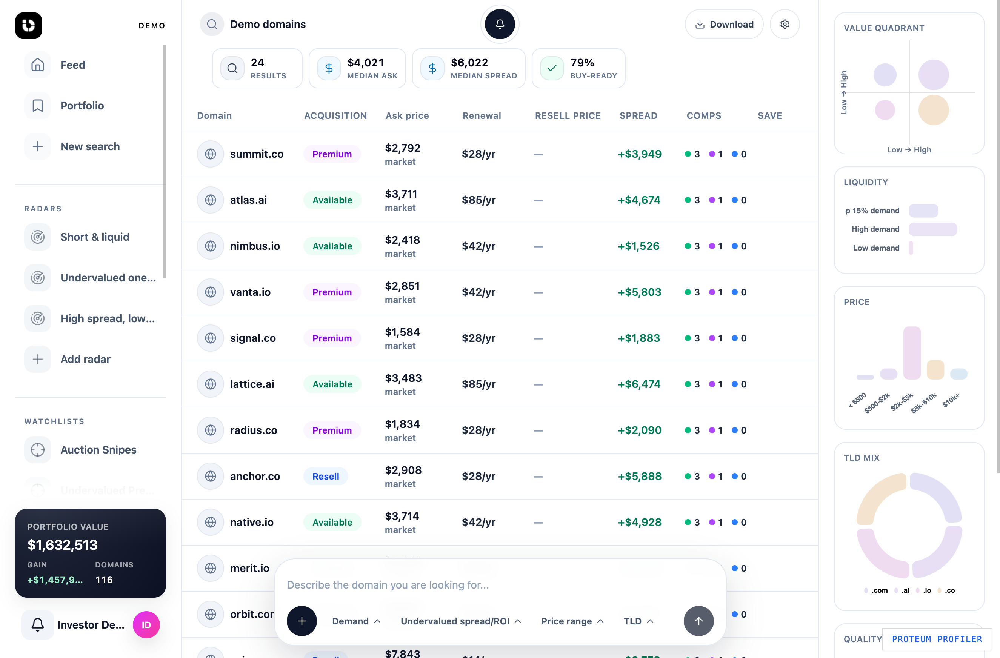

# Unique Domains Datasets

Public GitHub dataset landing pages for exact domain-search intent from Unique Domains.

Every flagship repository in this org is designed to answer four questions fast: what the dataset is, how large it is, whether it is maintained, and where the exact next step lives in the product. Use the exact matching repo when you want a citation-ready public extract. Use the exact matching live page when you want to continue the search, create a Radar, or start a Project without rebuilding context.

---

  <a href="https://unique.domains/domains?utm_source=github&utm_medium=referral&utm_campaign=org_profile&utm_content=top_open_search"><b>🗂️ Open live database</b></a> ·
  <a href="https://unique.domains/domains?github_intent=radar&utm_source=github&utm_medium=referral&utm_campaign=org_profile&utm_content=top_create_radar"><b>🔔 Create Radar</b></a> ·
  <a href="https://unique.domains/domains?github_intent=project&utm_source=github&utm_medium=referral&utm_campaign=org_profile&utm_content=top_start_project"><b>🚀 Start a Project</b></a> ·
  <a href="https://unique.domains/technology?utm_source=github&utm_medium=referral&utm_campaign=org_profile&utm_content=top_methodology"><b>🧪 Technology</b></a> ·
  <a href="https://unique.domains/api?utm_source=github&utm_medium=referral&utm_campaign=org_profile&utm_content=top_api_docs"><b>🧰 API docs</b></a>

---

## ✨ Unique Domains

Unique Domains turns domain discovery into a decision workflow. The public GitHub repos are citation-ready dataset landing pages for exact search intent, built so Google, GitHub, and LLM visitors can land on the exact dataset first and then continue into the exact live workflow without losing context.

The product is designed around saved intent, continuity, and decision speed rather than static lists alone. GitHub gives you the public extract, the files, and the citation surface. Unique Domains adds the full live catalog, fresh pricing and status changes, saved-search continuity, Radar monitoring, founder Projects, and deeper price, demand, and risk context without forcing you to rebuild the search from scratch.

### What Unique Domains adds

- 🗂️ Full live search for the exact dataset you started from on GitHub
- 🔔 Radar workflows for saved intent, monitoring, and follow-up
- 🚀 Founder Project flows for shortlist building and naming decisions
- 🧪 Richer decision context across pricing, demand, risk, and fit
- 🧰 API access for teams that want to connect domain search into their own stack

## 🧭 How to use this org

- Open a flagship repo when you want a public extract, citation metadata, methodology, and the exact dataset scope.
- Open the live page when you want the full catalog, saved-intent continuity, and the Radar or Project workflow.
- Use the tables below to move across the public repo network by general catalog, TLD, or sector.

## 🧭 General

| Dataset                                                               | Repo domains | App domains | See on App                                                                                                                                                         | Median ask | High-demand under $X | Buy-ready % |
| --------------------------------------------------------------------- | ------------ | ----------- | ------------------------------------------------------------------------------------------------------------------------------------------------------------------ | ---------- | -------------------- | ----------- |
| [Expired](https://github.com/UniqueDomains/expired-oneword-domains)   | 10,000       | 39,215      | [See on App](https://unique.domains/domains/expired?utm_source=github&utm_medium=referral&utm_campaign=repo_expired_oneword_domains&utm_content=hub_open_search)   | —          | —                    | —           |
| [Expiring](https://github.com/UniqueDomains/expiring-oneword-domains) | 10,000       | 93,978      | [See on App](https://unique.domains/domains/expiring?utm_source=github&utm_medium=referral&utm_campaign=repo_expiring_oneword_domains&utm_content=hub_open_search) | —          | —                    | —           |

## 🌐 By TLD

| Dataset                                                                            | Repo domains | App domains | See on App                                                                                                                                                                         | Median ask | High-demand under $X | Buy-ready % |
| ---------------------------------------------------------------------------------- | ------------ | ----------- | ---------------------------------------------------------------------------------------------------------------------------------------------------------------------------------- | ---------- | -------------------- | ----------- |
| [.APP](https://github.com/UniqueDomains/app-oneword-domains)                       | 0            | 0           | [See on App](https://unique.domains/domains/tld/app?utm_source=github&utm_medium=referral&utm_campaign=repo_app_oneword_domains&utm_content=hub_open_search)                       | —          | —                    | —           |
| [.ARCHI](https://github.com/UniqueDomains/archi-oneword-domains)                   | 0            | 0           | [See on App](https://unique.domains/domains/tld/archi?utm_source=github&utm_medium=referral&utm_campaign=repo_archi_oneword_domains&utm_content=hub_open_search)                   | —          | —                    | —           |
| [.ARMY](https://github.com/UniqueDomains/army-oneword-domains)                     | 0            | 0           | [See on App](https://unique.domains/domains/tld/army?utm_source=github&utm_medium=referral&utm_campaign=repo_army_oneword_domains&utm_content=hub_open_search)                     | —          | —                    | —           |
| [.ART](https://github.com/UniqueDomains/art-oneword-domains)                       | 0            | 0           | [See on App](https://unique.domains/domains/tld/art?utm_source=github&utm_medium=referral&utm_campaign=repo_art_oneword_domains&utm_content=hub_open_search)                       | —          | —                    | —           |
| [.ASIA](https://github.com/UniqueDomains/asia-oneword-domains)                     | 0            | 0           | [See on App](https://unique.domains/domains/tld/asia?utm_source=github&utm_medium=referral&utm_campaign=repo_asia_oneword_domains&utm_content=hub_open_search)                     | —          | —                    | —           |
| [.ASSOCIATES](https://github.com/UniqueDomains/associates-oneword-domains)         | 0            | 0           | [See on App](https://unique.domains/domains/tld/associates?utm_source=github&utm_medium=referral&utm_campaign=repo_associates_oneword_domains&utm_content=hub_open_search)         | —          | —                    | —           |
| [.AT](https://github.com/UniqueDomains/at-oneword-domains)                         | 0            | 0           | [See on App](https://unique.domains/domains/tld/at?utm_source=github&utm_medium=referral&utm_campaign=repo_at_oneword_domains&utm_content=hub_open_search)                         | —          | —                    | —           |
| [.ATTORNEY](https://github.com/UniqueDomains/attorney-oneword-domains)             | 0            | 0           | [See on App](https://unique.domains/domains/tld/attorney?utm_source=github&utm_medium=referral&utm_campaign=repo_attorney_oneword_domains&utm_content=hub_open_search)             | —          | —                    | —           |
| [.AUCTION](https://github.com/UniqueDomains/auction-oneword-domains)               | 0            | 0           | [See on App](https://unique.domains/domains/tld/auction?utm_source=github&utm_medium=referral&utm_campaign=repo_auction_oneword_domains&utm_content=hub_open_search)               | —          | —                    | —           |
| [.AUDIO](https://github.com/UniqueDomains/audio-oneword-domains)                   | 0            | 0           | [See on App](https://unique.domains/domains/tld/audio?utm_source=github&utm_medium=referral&utm_campaign=repo_audio_oneword_domains&utm_content=hub_open_search)                   | —          | —                    | —           |
| [.AUTO](https://github.com/UniqueDomains/auto-oneword-domains)                     | 0            | 0           | [See on App](https://unique.domains/domains/tld/auto?utm_source=github&utm_medium=referral&utm_campaign=repo_auto_oneword_domains&utm_content=hub_open_search)                     | —          | —                    | —           |
| [.AUTOS](https://github.com/UniqueDomains/autos-oneword-domains)                   | 0            | 0           | [See on App](https://unique.domains/domains/tld/autos?utm_source=github&utm_medium=referral&utm_campaign=repo_autos_oneword_domains&utm_content=hub_open_search)                   | —          | —                    | —           |
| [.BABY](https://github.com/UniqueDomains/baby-oneword-domains)                     | 0            | 0           | [See on App](https://unique.domains/domains/tld/baby?utm_source=github&utm_medium=referral&utm_campaign=repo_baby_oneword_domains&utm_content=hub_open_search)                     | —          | —                    | —           |
| [.BAND](https://github.com/UniqueDomains/band-oneword-domains)                     | 0            | 0           | [See on App](https://unique.domains/domains/tld/band?utm_source=github&utm_medium=referral&utm_campaign=repo_band_oneword_domains&utm_content=hub_open_search)                     | —          | —                    | —           |
| [.BAR](https://github.com/UniqueDomains/bar-oneword-domains)                       | 0            | 0           | [See on App](https://unique.domains/domains/tld/bar?utm_source=github&utm_medium=referral&utm_campaign=repo_bar_oneword_domains&utm_content=hub_open_search)                       | —          | —                    | —           |
| [.BARCELONA](https://github.com/UniqueDomains/barcelona-oneword-domains)           | 0            | 0           | [See on App](https://unique.domains/domains/tld/barcelona?utm_source=github&utm_medium=referral&utm_campaign=repo_barcelona_oneword_domains&utm_content=hub_open_search)           | —          | —                    | —           |
| [.BARGAINS](https://github.com/UniqueDomains/bargains-oneword-domains)             | 0            | 0           | [See on App](https://unique.domains/domains/tld/bargains?utm_source=github&utm_medium=referral&utm_campaign=repo_bargains_oneword_domains&utm_content=hub_open_search)             | —          | —                    | —           |
| [.BAYERN](https://github.com/UniqueDomains/bayern-oneword-domains)                 | 0            | 0           | [See on App](https://unique.domains/domains/tld/bayern?utm_source=github&utm_medium=referral&utm_campaign=repo_bayern_oneword_domains&utm_content=hub_open_search)                 | —          | —                    | —           |
| [.BEAUTY](https://github.com/UniqueDomains/beauty-oneword-domains)                 | 0            | 0           | [See on App](https://unique.domains/domains/tld/beauty?utm_source=github&utm_medium=referral&utm_campaign=repo_beauty_oneword_domains&utm_content=hub_open_search)                 | —          | —                    | —           |
| [.BEER](https://github.com/UniqueDomains/beer-oneword-domains)                     | 0            | 0           | [See on App](https://unique.domains/domains/tld/beer?utm_source=github&utm_medium=referral&utm_campaign=repo_beer_oneword_domains&utm_content=hub_open_search)                     | —          | —                    | —           |
| [.BERLIN](https://github.com/UniqueDomains/berlin-oneword-domains)                 | 0            | 0           | [See on App](https://unique.domains/domains/tld/berlin?utm_source=github&utm_medium=referral&utm_campaign=repo_berlin_oneword_domains&utm_content=hub_open_search)                 | —          | —                    | —           |
| [.BEST](https://github.com/UniqueDomains/best-oneword-domains)                     | 0            | 0           | [See on App](https://unique.domains/domains/tld/best?utm_source=github&utm_medium=referral&utm_campaign=repo_best_oneword_domains&utm_content=hub_open_search)                     | —          | —                    | —           |
| [.BET](https://github.com/UniqueDomains/bet-oneword-domains)                       | 0            | 0           | [See on App](https://unique.domains/domains/tld/bet?utm_source=github&utm_medium=referral&utm_campaign=repo_bet_oneword_domains&utm_content=hub_open_search)                       | —          | —                    | —           |
| [.BID](https://github.com/UniqueDomains/bid-oneword-domains)                       | 0            | 0           | [See on App](https://unique.domains/domains/tld/bid?utm_source=github&utm_medium=referral&utm_campaign=repo_bid_oneword_domains&utm_content=hub_open_search)                       | —          | —                    | —           |
| [.BIKE](https://github.com/UniqueDomains/bike-oneword-domains)                     | 0            | 0           | [See on App](https://unique.domains/domains/tld/bike?utm_source=github&utm_medium=referral&utm_campaign=repo_bike_oneword_domains&utm_content=hub_open_search)                     | —          | —                    | —           |
| [.BINGO](https://github.com/UniqueDomains/bingo-oneword-domains)                   | 0            | 0           | [See on App](https://unique.domains/domains/tld/bingo?utm_source=github&utm_medium=referral&utm_campaign=repo_bingo_oneword_domains&utm_content=hub_open_search)                   | —          | —                    | —           |
| [.BIO](https://github.com/UniqueDomains/bio-oneword-domains)                       | 0            | 0           | [See on App](https://unique.domains/domains/tld/bio?utm_source=github&utm_medium=referral&utm_campaign=repo_bio_oneword_domains&utm_content=hub_open_search)                       | —          | —                    | —           |
| [.BIZ](https://github.com/UniqueDomains/biz-oneword-domains)                       | 0            | 0           | [See on App](https://unique.domains/domains/tld/biz?utm_source=github&utm_medium=referral&utm_campaign=repo_biz_oneword_domains&utm_content=hub_open_search)                       | —          | —                    | —           |
| [.BLACK](https://github.com/UniqueDomains/black-oneword-domains)                   | 0            | 0           | [See on App](https://unique.domains/domains/tld/black?utm_source=github&utm_medium=referral&utm_campaign=repo_black_oneword_domains&utm_content=hub_open_search)                   | —          | —                    | —           |
| [.BLACKFRIDAY](https://github.com/UniqueDomains/blackfriday-oneword-domains)       | 0            | 0           | [See on App](https://unique.domains/domains/tld/blackfriday?utm_source=github&utm_medium=referral&utm_campaign=repo_blackfriday_oneword_domains&utm_content=hub_open_search)       | —          | —                    | —           |
| [.BLOG](https://github.com/UniqueDomains/blog-oneword-domains)                     | 0            | 0           | [See on App](https://unique.domains/domains/tld/blog?utm_source=github&utm_medium=referral&utm_campaign=repo_blog_oneword_domains&utm_content=hub_open_search)                     | —          | —                    | —           |
| [.BLUE](https://github.com/UniqueDomains/blue-oneword-domains)                     | 0            | 0           | [See on App](https://unique.domains/domains/tld/blue?utm_source=github&utm_medium=referral&utm_campaign=repo_blue_oneword_domains&utm_content=hub_open_search)                     | —          | —                    | —           |
| [.BOATS](https://github.com/UniqueDomains/boats-oneword-domains)                   | 0            | 0           | [See on App](https://unique.domains/domains/tld/boats?utm_source=github&utm_medium=referral&utm_campaign=repo_boats_oneword_domains&utm_content=hub_open_search)                   | —          | —                    | —           |
| [.BOND](https://github.com/UniqueDomains/bond-oneword-domains)                     | 0            | 0           | [See on App](https://unique.domains/domains/tld/bond?utm_source=github&utm_medium=referral&utm_campaign=repo_bond_oneword_domains&utm_content=hub_open_search)                     | —          | —                    | —           |
| [.BOO](https://github.com/UniqueDomains/boo-oneword-domains)                       | 0            | 0           | [See on App](https://unique.domains/domains/tld/boo?utm_source=github&utm_medium=referral&utm_campaign=repo_boo_oneword_domains&utm_content=hub_open_search)                       | —          | —                    | —           |
| [.BOSTON](https://github.com/UniqueDomains/boston-oneword-domains)                 | 0            | 0           | [See on App](https://unique.domains/domains/tld/boston?utm_source=github&utm_medium=referral&utm_campaign=repo_boston_oneword_domains&utm_content=hub_open_search)                 | —          | —                    | —           |
| [.BOT](https://github.com/UniqueDomains/bot-oneword-domains)                       | 0            | 0           | [See on App](https://unique.domains/domains/tld/bot?utm_source=github&utm_medium=referral&utm_campaign=repo_bot_oneword_domains&utm_content=hub_open_search)                       | —          | —                    | —           |
| [.BOUTIQUE](https://github.com/UniqueDomains/boutique-oneword-domains)             | 0            | 0           | [See on App](https://unique.domains/domains/tld/boutique?utm_source=github&utm_medium=referral&utm_campaign=repo_boutique_oneword_domains&utm_content=hub_open_search)             | —          | —                    | —           |
| [.BROKER](https://github.com/UniqueDomains/broker-oneword-domains)                 | 0            | 0           | [See on App](https://unique.domains/domains/tld/broker?utm_source=github&utm_medium=referral&utm_campaign=repo_broker_oneword_domains&utm_content=hub_open_search)                 | —          | —                    | —           |
| [.BUILD](https://github.com/UniqueDomains/build-oneword-domains)                   | 0            | 0           | [See on App](https://unique.domains/domains/tld/build?utm_source=github&utm_medium=referral&utm_campaign=repo_build_oneword_domains&utm_content=hub_open_search)                   | —          | —                    | —           |
| [.BUILDERS](https://github.com/UniqueDomains/builders-oneword-domains)             | 0            | 0           | [See on App](https://unique.domains/domains/tld/builders?utm_source=github&utm_medium=referral&utm_campaign=repo_builders_oneword_domains&utm_content=hub_open_search)             | —          | —                    | —           |
| [.BUSINESS](https://github.com/UniqueDomains/business-oneword-domains)             | 0            | 0           | [See on App](https://unique.domains/domains/tld/business?utm_source=github&utm_medium=referral&utm_campaign=repo_business_oneword_domains&utm_content=hub_open_search)             | —          | —                    | —           |
| [.BUZZ](https://github.com/UniqueDomains/buzz-oneword-domains)                     | 0            | 0           | [See on App](https://unique.domains/domains/tld/buzz?utm_source=github&utm_medium=referral&utm_campaign=repo_buzz_oneword_domains&utm_content=hub_open_search)                     | —          | —                    | —           |
| [.BZ](https://github.com/UniqueDomains/bz-oneword-domains)                         | 0            | 0           | [See on App](https://unique.domains/domains/tld/bz?utm_source=github&utm_medium=referral&utm_campaign=repo_bz_oneword_domains&utm_content=hub_open_search)                         | —          | —                    | —           |
| [.CA](https://github.com/UniqueDomains/ca-oneword-domains)                         | 0            | 0           | [See on App](https://unique.domains/domains/tld/ca?utm_source=github&utm_medium=referral&utm_campaign=repo_ca_oneword_domains&utm_content=hub_open_search)                         | —          | —                    | —           |
| [.CAB](https://github.com/UniqueDomains/cab-oneword-domains)                       | 0            | 0           | [See on App](https://unique.domains/domains/tld/cab?utm_source=github&utm_medium=referral&utm_campaign=repo_cab_oneword_domains&utm_content=hub_open_search)                       | —          | —                    | —           |
| [.CAFE](https://github.com/UniqueDomains/cafe-oneword-domains)                     | 0            | 0           | [See on App](https://unique.domains/domains/tld/cafe?utm_source=github&utm_medium=referral&utm_campaign=repo_cafe_oneword_domains&utm_content=hub_open_search)                     | —          | —                    | —           |
| [.CAM](https://github.com/UniqueDomains/cam-oneword-domains)                       | 0            | 0           | [See on App](https://unique.domains/domains/tld/cam?utm_source=github&utm_medium=referral&utm_campaign=repo_cam_oneword_domains&utm_content=hub_open_search)                       | —          | —                    | —           |
| [.CAMERA](https://github.com/UniqueDomains/camera-oneword-domains)                 | 0            | 0           | [See on App](https://unique.domains/domains/tld/camera?utm_source=github&utm_medium=referral&utm_campaign=repo_camera_oneword_domains&utm_content=hub_open_search)                 | —          | —                    | —           |
| [.CAMP](https://github.com/UniqueDomains/camp-oneword-domains)                     | 0            | 0           | [See on App](https://unique.domains/domains/tld/camp?utm_source=github&utm_medium=referral&utm_campaign=repo_camp_oneword_domains&utm_content=hub_open_search)                     | —          | —                    | —           |
| [.CAPITAL](https://github.com/UniqueDomains/capital-oneword-domains)               | 0            | 0           | [See on App](https://unique.domains/domains/tld/capital?utm_source=github&utm_medium=referral&utm_campaign=repo_capital_oneword_domains&utm_content=hub_open_search)               | —          | —                    | —           |
| [.CAR](https://github.com/UniqueDomains/car-oneword-domains)                       | 0            | 0           | [See on App](https://unique.domains/domains/tld/car?utm_source=github&utm_medium=referral&utm_campaign=repo_car_oneword_domains&utm_content=hub_open_search)                       | —          | —                    | —           |
| [.CARDS](https://github.com/UniqueDomains/cards-oneword-domains)                   | 0            | 0           | [See on App](https://unique.domains/domains/tld/cards?utm_source=github&utm_medium=referral&utm_campaign=repo_cards_oneword_domains&utm_content=hub_open_search)                   | —          | —                    | —           |
| [.CARE](https://github.com/UniqueDomains/care-oneword-domains)                     | 0            | 0           | [See on App](https://unique.domains/domains/tld/care?utm_source=github&utm_medium=referral&utm_campaign=repo_care_oneword_domains&utm_content=hub_open_search)                     | —          | —                    | —           |
| [.CAREERS](https://github.com/UniqueDomains/careers-oneword-domains)               | 0            | 0           | [See on App](https://unique.domains/domains/tld/careers?utm_source=github&utm_medium=referral&utm_campaign=repo_careers_oneword_domains&utm_content=hub_open_search)               | —          | —                    | —           |
| [.CARS](https://github.com/UniqueDomains/cars-oneword-domains)                     | 0            | 0           | [See on App](https://unique.domains/domains/tld/cars?utm_source=github&utm_medium=referral&utm_campaign=repo_cars_oneword_domains&utm_content=hub_open_search)                     | —          | —                    | —           |
| [.CASA](https://github.com/UniqueDomains/casa-oneword-domains)                     | 0            | 0           | [See on App](https://unique.domains/domains/tld/casa?utm_source=github&utm_medium=referral&utm_campaign=repo_casa_oneword_domains&utm_content=hub_open_search)                     | —          | —                    | —           |
| [.CASH](https://github.com/UniqueDomains/cash-oneword-domains)                     | 0            | 0           | [See on App](https://unique.domains/domains/tld/cash?utm_source=github&utm_medium=referral&utm_campaign=repo_cash_oneword_domains&utm_content=hub_open_search)                     | —          | —                    | —           |
| [.CASINO](https://github.com/UniqueDomains/casino-oneword-domains)                 | 0            | 0           | [See on App](https://unique.domains/domains/tld/casino?utm_source=github&utm_medium=referral&utm_campaign=repo_casino_oneword_domains&utm_content=hub_open_search)                 | —          | —                    | —           |
| [.CATERING](https://github.com/UniqueDomains/catering-oneword-domains)             | 0            | 0           | [See on App](https://unique.domains/domains/tld/catering?utm_source=github&utm_medium=referral&utm_campaign=repo_catering_oneword_domains&utm_content=hub_open_search)             | —          | —                    | —           |
| [.CC](https://github.com/UniqueDomains/cc-oneword-domains)                         | 0            | 0           | [See on App](https://unique.domains/domains/tld/cc?utm_source=github&utm_medium=referral&utm_campaign=repo_cc_oneword_domains&utm_content=hub_open_search)                         | —          | —                    | —           |
| [.CENTER](https://github.com/UniqueDomains/center-oneword-domains)                 | 0            | 0           | [See on App](https://unique.domains/domains/tld/center?utm_source=github&utm_medium=referral&utm_campaign=repo_center_oneword_domains&utm_content=hub_open_search)                 | —          | —                    | —           |
| [.CEO](https://github.com/UniqueDomains/ceo-oneword-domains)                       | 0            | 0           | [See on App](https://unique.domains/domains/tld/ceo?utm_source=github&utm_medium=referral&utm_campaign=repo_ceo_oneword_domains&utm_content=hub_open_search)                       | —          | —                    | —           |
| [.CFD](https://github.com/UniqueDomains/cfd-oneword-domains)                       | 0            | 0           | [See on App](https://unique.domains/domains/tld/cfd?utm_source=github&utm_medium=referral&utm_campaign=repo_cfd_oneword_domains&utm_content=hub_open_search)                       | —          | —                    | —           |
| [.CHANNEL](https://github.com/UniqueDomains/channel-oneword-domains)               | 0            | 0           | [See on App](https://unique.domains/domains/tld/channel?utm_source=github&utm_medium=referral&utm_campaign=repo_channel_oneword_domains&utm_content=hub_open_search)               | —          | —                    | —           |
| [.CHARITY](https://github.com/UniqueDomains/charity-oneword-domains)               | 0            | 0           | [See on App](https://unique.domains/domains/tld/charity?utm_source=github&utm_medium=referral&utm_campaign=repo_charity_oneword_domains&utm_content=hub_open_search)               | —          | —                    | —           |
| [.CHAT](https://github.com/UniqueDomains/chat-oneword-domains)                     | 0            | 0           | [See on App](https://unique.domains/domains/tld/chat?utm_source=github&utm_medium=referral&utm_campaign=repo_chat_oneword_domains&utm_content=hub_open_search)                     | —          | —                    | —           |
| [.CHEAP](https://github.com/UniqueDomains/cheap-oneword-domains)                   | 0            | 0           | [See on App](https://unique.domains/domains/tld/cheap?utm_source=github&utm_medium=referral&utm_campaign=repo_cheap_oneword_domains&utm_content=hub_open_search)                   | —          | —                    | —           |
| [.CHRISTMAS](https://github.com/UniqueDomains/christmas-oneword-domains)           | 0            | 0           | [See on App](https://unique.domains/domains/tld/christmas?utm_source=github&utm_medium=referral&utm_campaign=repo_christmas_oneword_domains&utm_content=hub_open_search)           | —          | —                    | —           |
| [.CHURCH](https://github.com/UniqueDomains/church-oneword-domains)                 | 0            | 0           | [See on App](https://unique.domains/domains/tld/church?utm_source=github&utm_medium=referral&utm_campaign=repo_church_oneword_domains&utm_content=hub_open_search)                 | —          | —                    | —           |
| [.CITY](https://github.com/UniqueDomains/city-oneword-domains)                     | 0            | 0           | [See on App](https://unique.domains/domains/tld/city?utm_source=github&utm_medium=referral&utm_campaign=repo_city_oneword_domains&utm_content=hub_open_search)                     | —          | —                    | —           |
| [.CLAIMS](https://github.com/UniqueDomains/claims-oneword-domains)                 | 0            | 0           | [See on App](https://unique.domains/domains/tld/claims?utm_source=github&utm_medium=referral&utm_campaign=repo_claims_oneword_domains&utm_content=hub_open_search)                 | —          | —                    | —           |
| [.CLEANING](https://github.com/UniqueDomains/cleaning-oneword-domains)             | 0            | 0           | [See on App](https://unique.domains/domains/tld/cleaning?utm_source=github&utm_medium=referral&utm_campaign=repo_cleaning_oneword_domains&utm_content=hub_open_search)             | —          | —                    | —           |
| [.CLICK](https://github.com/UniqueDomains/click-oneword-domains)                   | 0            | 0           | [See on App](https://unique.domains/domains/tld/click?utm_source=github&utm_medium=referral&utm_campaign=repo_click_oneword_domains&utm_content=hub_open_search)                   | —          | —                    | —           |
| [.CLINIC](https://github.com/UniqueDomains/clinic-oneword-domains)                 | 0            | 0           | [See on App](https://unique.domains/domains/tld/clinic?utm_source=github&utm_medium=referral&utm_campaign=repo_clinic_oneword_domains&utm_content=hub_open_search)                 | —          | —                    | —           |
| [.CLOTHING](https://github.com/UniqueDomains/clothing-oneword-domains)             | 0            | 0           | [See on App](https://unique.domains/domains/tld/clothing?utm_source=github&utm_medium=referral&utm_campaign=repo_clothing_oneword_domains&utm_content=hub_open_search)             | —          | —                    | —           |
| [.CLOUD](https://github.com/UniqueDomains/cloud-oneword-domains)                   | 10,000       | 5,620,582   | [See on App](https://unique.domains/domains/tld/cloud?utm_source=github&utm_medium=referral&utm_campaign=repo_cloud_oneword_domains&utm_content=hub_open_search)                   | —          | —                    | —           |
| [.CLUB](https://github.com/UniqueDomains/club-oneword-domains)                     | 0            | 0           | [See on App](https://unique.domains/domains/tld/club?utm_source=github&utm_medium=referral&utm_campaign=repo_club_oneword_domains&utm_content=hub_open_search)                     | —          | —                    | —           |
| [.CN](https://github.com/UniqueDomains/cn-oneword-domains)                         | 0            | 0           | [See on App](https://unique.domains/domains/tld/cn?utm_source=github&utm_medium=referral&utm_campaign=repo_cn_oneword_domains&utm_content=hub_open_search)                         | —          | —                    | —           |
| [.CO](https://github.com/UniqueDomains/co-oneword-domains)                         | 0            | 0           | [See on App](https://unique.domains/domains/tld/co?utm_source=github&utm_medium=referral&utm_campaign=repo_co_oneword_domains&utm_content=hub_open_search)                         | —          | —                    | —           |
| [.COACH](https://github.com/UniqueDomains/coach-oneword-domains)                   | 0            | 0           | [See on App](https://unique.domains/domains/tld/coach?utm_source=github&utm_medium=referral&utm_campaign=repo_coach_oneword_domains&utm_content=hub_open_search)                   | —          | —                    | —           |
| [.CODES](https://github.com/UniqueDomains/codes-oneword-domains)                   | 0            | 0           | [See on App](https://unique.domains/domains/tld/codes?utm_source=github&utm_medium=referral&utm_campaign=repo_codes_oneword_domains&utm_content=hub_open_search)                   | —          | —                    | —           |
| [.COFFEE](https://github.com/UniqueDomains/coffee-oneword-domains)                 | 0            | 0           | [See on App](https://unique.domains/domains/tld/coffee?utm_source=github&utm_medium=referral&utm_campaign=repo_coffee_oneword_domains&utm_content=hub_open_search)                 | —          | —                    | —           |
| [.COLLEGE](https://github.com/UniqueDomains/college-oneword-domains)               | 0            | 0           | [See on App](https://unique.domains/domains/tld/college?utm_source=github&utm_medium=referral&utm_campaign=repo_college_oneword_domains&utm_content=hub_open_search)               | —          | —                    | —           |
| [.COM](https://github.com/UniqueDomains/com-oneword-domains)                       | 0            | 0           | [See on App](https://unique.domains/domains/tld/com?utm_source=github&utm_medium=referral&utm_campaign=repo_com_oneword_domains&utm_content=hub_open_search)                       | —          | —                    | —           |
| [.COMMUNITY](https://github.com/UniqueDomains/community-oneword-domains)           | 0            | 0           | [See on App](https://unique.domains/domains/tld/community?utm_source=github&utm_medium=referral&utm_campaign=repo_community_oneword_domains&utm_content=hub_open_search)           | —          | —                    | —           |
| [.COMPANY](https://github.com/UniqueDomains/company-oneword-domains)               | 0            | 0           | [See on App](https://unique.domains/domains/tld/company?utm_source=github&utm_medium=referral&utm_campaign=repo_company_oneword_domains&utm_content=hub_open_search)               | —          | —                    | —           |
| [.COMPUTER](https://github.com/UniqueDomains/computer-oneword-domains)             | 0            | 0           | [See on App](https://unique.domains/domains/tld/computer?utm_source=github&utm_medium=referral&utm_campaign=repo_computer_oneword_domains&utm_content=hub_open_search)             | —          | —                    | —           |
| [.CONDOS](https://github.com/UniqueDomains/condos-oneword-domains)                 | 0            | 0           | [See on App](https://unique.domains/domains/tld/condos?utm_source=github&utm_medium=referral&utm_campaign=repo_condos_oneword_domains&utm_content=hub_open_search)                 | —          | —                    | —           |
| [.CONSTRUCTION](https://github.com/UniqueDomains/construction-oneword-domains)     | 0            | 0           | [See on App](https://unique.domains/domains/tld/construction?utm_source=github&utm_medium=referral&utm_campaign=repo_construction_oneword_domains&utm_content=hub_open_search)     | —          | —                    | —           |
| [.CONSULTING](https://github.com/UniqueDomains/consulting-oneword-domains)         | 0            | 0           | [See on App](https://unique.domains/domains/tld/consulting?utm_source=github&utm_medium=referral&utm_campaign=repo_consulting_oneword_domains&utm_content=hub_open_search)         | —          | —                    | —           |
| [.CONTACT](https://github.com/UniqueDomains/contact-oneword-domains)               | 0            | 0           | [See on App](https://unique.domains/domains/tld/contact?utm_source=github&utm_medium=referral&utm_campaign=repo_contact_oneword_domains&utm_content=hub_open_search)               | —          | —                    | —           |
| [.CONTRACTORS](https://github.com/UniqueDomains/contractors-oneword-domains)       | 0            | 0           | [See on App](https://unique.domains/domains/tld/contractors?utm_source=github&utm_medium=referral&utm_campaign=repo_contractors_oneword_domains&utm_content=hub_open_search)       | —          | —                    | —           |
| [.COOKING](https://github.com/UniqueDomains/cooking-oneword-domains)               | 0            | 0           | [See on App](https://unique.domains/domains/tld/cooking?utm_source=github&utm_medium=referral&utm_campaign=repo_cooking_oneword_domains&utm_content=hub_open_search)               | —          | —                    | —           |
| [.COOL](https://github.com/UniqueDomains/cool-oneword-domains)                     | 0            | 0           | [See on App](https://unique.domains/domains/tld/cool?utm_source=github&utm_medium=referral&utm_campaign=repo_cool_oneword_domains&utm_content=hub_open_search)                     | —          | —                    | —           |
| [.COUNTRY](https://github.com/UniqueDomains/country-oneword-domains)               | 0            | 0           | [See on App](https://unique.domains/domains/tld/country?utm_source=github&utm_medium=referral&utm_campaign=repo_country_oneword_domains&utm_content=hub_open_search)               | —          | —                    | —           |
| [.COUPONS](https://github.com/UniqueDomains/coupons-oneword-domains)               | 0            | 0           | [See on App](https://unique.domains/domains/tld/coupons?utm_source=github&utm_medium=referral&utm_campaign=repo_coupons_oneword_domains&utm_content=hub_open_search)               | —          | —                    | —           |
| [.COURSES](https://github.com/UniqueDomains/courses-oneword-domains)               | 0            | 0           | [See on App](https://unique.domains/domains/tld/courses?utm_source=github&utm_medium=referral&utm_campaign=repo_courses_oneword_domains&utm_content=hub_open_search)               | —          | —                    | —           |
| [.CREDIT](https://github.com/UniqueDomains/credit-oneword-domains)                 | 0            | 0           | [See on App](https://unique.domains/domains/tld/credit?utm_source=github&utm_medium=referral&utm_campaign=repo_credit_oneword_domains&utm_content=hub_open_search)                 | —          | —                    | —           |
| [.CREDITCARD](https://github.com/UniqueDomains/creditcard-oneword-domains)         | 0            | 0           | [See on App](https://unique.domains/domains/tld/creditcard?utm_source=github&utm_medium=referral&utm_campaign=repo_creditcard_oneword_domains&utm_content=hub_open_search)         | —          | —                    | —           |
| [.CRICKET](https://github.com/UniqueDomains/cricket-oneword-domains)               | 0            | 0           | [See on App](https://unique.domains/domains/tld/cricket?utm_source=github&utm_medium=referral&utm_campaign=repo_cricket_oneword_domains&utm_content=hub_open_search)               | —          | —                    | —           |
| [.CRUISES](https://github.com/UniqueDomains/cruises-oneword-domains)               | 0            | 0           | [See on App](https://unique.domains/domains/tld/cruises?utm_source=github&utm_medium=referral&utm_campaign=repo_cruises_oneword_domains&utm_content=hub_open_search)               | —          | —                    | —           |
| [..EXPERT](https://github.com/UniqueDomains/.expert-oneword-domains)               | 10,000       | 80,346      | [See on App](https://unique.domains/domains/tld/.expert?utm_source=github&utm_medium=referral&utm_campaign=repo_.expert_oneword_domains&utm_content=hub_open_search)               | —          | —                    | —           |
| [.AC](https://github.com/UniqueDomains/ac-oneword-domains)                         | 8,505        | 8,505       | [See on App](https://unique.domains/domains/tld/ac?utm_source=github&utm_medium=referral&utm_campaign=repo_ac_oneword_domains&utm_content=hub_open_search)                         | —          | —                    | —           |
| [.ACADEMY](https://github.com/UniqueDomains/academy-oneword-domains)               | 7,817        | 7,817       | [See on App](https://unique.domains/domains/tld/academy?utm_source=github&utm_medium=referral&utm_campaign=repo_academy_oneword_domains&utm_content=hub_open_search)               | —          | —                    | —           |
| [.ACCOUNTANT](https://github.com/UniqueDomains/accountant-oneword-domains)         | 9,872        | 9,872       | [See on App](https://unique.domains/domains/tld/accountant?utm_source=github&utm_medium=referral&utm_campaign=repo_accountant_oneword_domains&utm_content=hub_open_search)         | —          | —                    | —           |
| [.ACCOUNTANTS](https://github.com/UniqueDomains/accountants-oneword-domains)       | 9,771        | 9,771       | [See on App](https://unique.domains/domains/tld/accountants?utm_source=github&utm_medium=referral&utm_campaign=repo_accountants_oneword_domains&utm_content=hub_open_search)       | —          | —                    | —           |
| [.ACTOR](https://github.com/UniqueDomains/actor-oneword-domains)                   | 9,710        | 9,710       | [See on App](https://unique.domains/domains/tld/actor?utm_source=github&utm_medium=referral&utm_campaign=repo_actor_oneword_domains&utm_content=hub_open_search)                   | —          | —                    | —           |
| [.ADULT](https://github.com/UniqueDomains/adult-oneword-domains)                   | 9,745        | 9,745       | [See on App](https://unique.domains/domains/tld/adult?utm_source=github&utm_medium=referral&utm_campaign=repo_adult_oneword_domains&utm_content=hub_open_search)                   | —          | —                    | —           |
| [.AG](https://github.com/UniqueDomains/ag-oneword-domains)                         | 8,588        | 8,588       | [See on App](https://unique.domains/domains/tld/ag?utm_source=github&utm_medium=referral&utm_campaign=repo_ag_oneword_domains&utm_content=hub_open_search)                         | —          | —                    | —           |
| [.AGENCY](https://github.com/UniqueDomains/agency-oneword-domains)                 | 7,020        | 7,020       | [See on App](https://unique.domains/domains/tld/agency?utm_source=github&utm_medium=referral&utm_campaign=repo_agency_oneword_domains&utm_content=hub_open_search)                 | —          | —                    | —           |
| [.AI](https://github.com/UniqueDomains/ai-oneword-domains)                         | 10,000       | 54,119      | [See on App](https://unique.domains/domains/tld/ai?utm_source=github&utm_medium=referral&utm_campaign=repo_ai_oneword_domains&utm_content=top_open_search)                         | —          | —                    | —           |
| [.AIRFORCE](https://github.com/UniqueDomains/airforce-oneword-domains)             | 9,856        | 9,856       | [See on App](https://unique.domains/domains/tld/airforce?utm_source=github&utm_medium=referral&utm_campaign=repo_airforce_oneword_domains&utm_content=hub_open_search)             | —          | —                    | —           |
| [.APARTMENTS](https://github.com/UniqueDomains/apartments-oneword-domains)         | 9,642        | 9,642       | [See on App](https://unique.domains/domains/tld/apartments?utm_source=github&utm_medium=referral&utm_campaign=repo_apartments_oneword_domains&utm_content=hub_open_search)         | —          | —                    | —           |
| [.CODEXVERIFYTLD](https://github.com/UniqueDomains/codexverifytld-oneword-domains) | 0            | 0           | [See on App](https://unique.domains/domains/tld/codexverifytld?utm_source=github&utm_medium=referral&utm_campaign=repo_codexverifytld_oneword_domains&utm_content=hub_open_search) | —          | —                    | —           |

## 🏷️ By Sector

| Dataset                                                                                   | Repo domains | App domains | See on App                                                                                                                                                                                    | Median ask | High-demand under $X | Buy-ready % |
| ----------------------------------------------------------------------------------------- | ------------ | ----------- | --------------------------------------------------------------------------------------------------------------------------------------------------------------------------------------------- | ---------- | -------------------- | ----------- |
| [Agriculture](https://github.com/UniqueDomains/agriculture-oneword-domains)               | 665          | 665         | [See on App](https://unique.domains/domains/sector/agriculture?utm_source=github&utm_medium=referral&utm_campaign=repo_agriculture_oneword_domains&utm_content=hub_open_search)               | —          | —                    | —           |
| [Arts](https://github.com/UniqueDomains/arts-oneword-domains)                             | 5,564        | 5,564       | [See on App](https://unique.domains/domains/sector/arts?utm_source=github&utm_medium=referral&utm_campaign=repo_arts_oneword_domains&utm_content=hub_open_search)                             | —          | —                    | —           |
| [Automotive](https://github.com/UniqueDomains/automotive-oneword-domains)                 | 0            | 0           | [See on App](https://unique.domains/domains/sector/automotive?utm_source=github&utm_medium=referral&utm_campaign=repo_automotive_oneword_domains&utm_content=hub_open_search)                 | —          | —                    | —           |
| [Aviation](https://github.com/UniqueDomains/aviation-oneword-domains)                     | 0            | 0           | [See on App](https://unique.domains/domains/sector/aviation?utm_source=github&utm_medium=referral&utm_campaign=repo_aviation_oneword_domains&utm_content=hub_open_search)                     | —          | —                    | —           |
| [Banking](https://github.com/UniqueDomains/banking-oneword-domains)                       | 1,518        | 1,518       | [See on App](https://unique.domains/domains/sector/banking?utm_source=github&utm_medium=referral&utm_campaign=repo_banking_oneword_domains&utm_content=hub_open_search)                       | —          | —                    | —           |
| [Business](https://github.com/UniqueDomains/business-oneword-domains)                     | 9,298        | 9,298       | [See on App](https://unique.domains/domains/sector/business?utm_source=github&utm_medium=referral&utm_campaign=repo_business_oneword_domains&utm_content=hub_open_search)                     | —          | —                    | —           |
| [Construction](https://github.com/UniqueDomains/construction-oneword-domains)             | 1,885        | 1,885       | [See on App](https://unique.domains/domains/sector/construction?utm_source=github&utm_medium=referral&utm_campaign=repo_construction_oneword_domains&utm_content=hub_open_search)             | —          | —                    | —           |
| [Education](https://github.com/UniqueDomains/education-oneword-domains)                   | 1,666        | 1,666       | [See on App](https://unique.domains/domains/sector/education?utm_source=github&utm_medium=referral&utm_campaign=repo_education_oneword_domains&utm_content=hub_open_search)                   | —          | —                    | —           |
| [Energy](https://github.com/UniqueDomains/energy-oneword-domains)                         | 2,133        | 2,133       | [See on App](https://unique.domains/domains/sector/energy?utm_source=github&utm_medium=referral&utm_campaign=repo_energy_oneword_domains&utm_content=hub_open_search)                         | —          | —                    | —           |
| [Engineering](https://github.com/UniqueDomains/engineering-oneword-domains)               | 420          | 420         | [See on App](https://unique.domains/domains/sector/engineering?utm_source=github&utm_medium=referral&utm_campaign=repo_engineering_oneword_domains&utm_content=hub_open_search)               | —          | —                    | —           |
| [Entertainment](https://github.com/UniqueDomains/entertainment-oneword-domains)           | 5,577        | 5,577       | [See on App](https://unique.domains/domains/sector/entertainment?utm_source=github&utm_medium=referral&utm_campaign=repo_entertainment_oneword_domains&utm_content=hub_open_search)           | —          | —                    | —           |
| [Environment](https://github.com/UniqueDomains/environment-oneword-domains)               | 1,927        | 1,927       | [See on App](https://unique.domains/domains/sector/environment?utm_source=github&utm_medium=referral&utm_campaign=repo_environment_oneword_domains&utm_content=hub_open_search)               | —          | —                    | —           |
| [Fashion](https://github.com/UniqueDomains/fashion-oneword-domains)                       | 3,971        | 3,971       | [See on App](https://unique.domains/domains/sector/fashion?utm_source=github&utm_medium=referral&utm_campaign=repo_fashion_oneword_domains&utm_content=hub_open_search)                       | —          | —                    | —           |
| [Finance](https://github.com/UniqueDomains/finance-oneword-domains)                       | 0            | 0           | [See on App](https://unique.domains/domains/sector/finance?utm_source=github&utm_medium=referral&utm_campaign=repo_finance_oneword_domains&utm_content=hub_open_search)                       | —          | —                    | —           |
| [Food](https://github.com/UniqueDomains/food-oneword-domains)                             | 10,000       | 12,359      | [See on App](https://unique.domains/domains/sector/food?utm_source=github&utm_medium=referral&utm_campaign=repo_food_oneword_domains&utm_content=hub_open_search)                             | —          | —                    | —           |
| [General](https://github.com/UniqueDomains/general-oneword-domains)                       | 1,465        | 1,465       | [See on App](https://unique.domains/domains/sector/general?utm_source=github&utm_medium=referral&utm_campaign=repo_general_oneword_domains&utm_content=hub_open_search)                       | —          | —                    | —           |
| [Geography](https://github.com/UniqueDomains/geography-oneword-domains)                   | 4,129        | 4,129       | [See on App](https://unique.domains/domains/sector/geography?utm_source=github&utm_medium=referral&utm_campaign=repo_geography_oneword_domains&utm_content=hub_open_search)                   | —          | —                    | —           |
| [Health](https://github.com/UniqueDomains/health-oneword-domains)                         | 3,227        | 3,227       | [See on App](https://unique.domains/domains/sector/health?utm_source=github&utm_medium=referral&utm_campaign=repo_health_oneword_domains&utm_content=hub_open_search)                         | —          | —                    | —           |
| [Healthcare](https://github.com/UniqueDomains/healthcare-oneword-domains)                 | 2,435        | 2,435       | [See on App](https://unique.domains/domains/sector/healthcare?utm_source=github&utm_medium=referral&utm_campaign=repo_healthcare_oneword_domains&utm_content=hub_open_search)                 | —          | —                    | —           |
| [Hospitality](https://github.com/UniqueDomains/hospitality-oneword-domains)               | 0            | 0           | [See on App](https://unique.domains/domains/sector/hospitality?utm_source=github&utm_medium=referral&utm_campaign=repo_hospitality_oneword_domains&utm_content=hub_open_search)               | —          | —                    | —           |
| [Humanities](https://github.com/UniqueDomains/humanities-oneword-domains)                 | 2,119        | 2,119       | [See on App](https://unique.domains/domains/sector/humanities?utm_source=github&utm_medium=referral&utm_campaign=repo_humanities_oneword_domains&utm_content=hub_open_search)                 | —          | —                    | —           |
| [Insurance](https://github.com/UniqueDomains/insurance-oneword-domains)                   | 4,030        | 4,030       | [See on App](https://unique.domains/domains/sector/insurance?utm_source=github&utm_medium=referral&utm_campaign=repo_insurance_oneword_domains&utm_content=hub_open_search)                   | —          | —                    | —           |
| [Law](https://github.com/UniqueDomains/law-oneword-domains)                               | 4,013        | 4,013       | [See on App](https://unique.domains/domains/sector/law?utm_source=github&utm_medium=referral&utm_campaign=repo_law_oneword_domains&utm_content=hub_open_search)                               | —          | —                    | —           |
| [Manufacturing](https://github.com/UniqueDomains/manufacturing-oneword-domains)           | 0            | 0           | [See on App](https://unique.domains/domains/sector/manufacturing?utm_source=github&utm_medium=referral&utm_campaign=repo_manufacturing_oneword_domains&utm_content=hub_open_search)           | —          | —                    | —           |
| [Mathematics](https://github.com/UniqueDomains/mathematics-oneword-domains)               | 0            | 0           | [See on App](https://unique.domains/domains/sector/mathematics?utm_source=github&utm_medium=referral&utm_campaign=repo_mathematics_oneword_domains&utm_content=hub_open_search)               | —          | —                    | —           |
| [Media](https://github.com/UniqueDomains/media-oneword-domains)                           | 3,283        | 3,283       | [See on App](https://unique.domains/domains/sector/media?utm_source=github&utm_medium=referral&utm_campaign=repo_media_oneword_domains&utm_content=hub_open_search)                           | —          | —                    | —           |
| [Medicine](https://github.com/UniqueDomains/medicine-oneword-domains)                     | 3,012        | 3,012       | [See on App](https://unique.domains/domains/sector/medicine?utm_source=github&utm_medium=referral&utm_campaign=repo_medicine_oneword_domains&utm_content=hub_open_search)                     | —          | —                    | —           |
| [Military](https://github.com/UniqueDomains/military-oneword-domains)                     | 6,927        | 6,927       | [See on App](https://unique.domains/domains/sector/military?utm_source=github&utm_medium=referral&utm_campaign=repo_military_oneword_domains&utm_content=hub_open_search)                     | —          | —                    | —           |
| [Mining](https://github.com/UniqueDomains/mining-oneword-domains)                         | 0            | 0           | [See on App](https://unique.domains/domains/sector/mining?utm_source=github&utm_medium=referral&utm_campaign=repo_mining_oneword_domains&utm_content=hub_open_search)                         | —          | —                    | —           |
| [Pharmaceuticals](https://github.com/UniqueDomains/pharmaceuticals-oneword-domains)       | 3,287        | 3,287       | [See on App](https://unique.domains/domains/sector/pharmaceuticals?utm_source=github&utm_medium=referral&utm_campaign=repo_pharmaceuticals_oneword_domains&utm_content=hub_open_search)       | —          | —                    | —           |
| [Politics](https://github.com/UniqueDomains/politics-oneword-domains)                     | 4,589        | 4,589       | [See on App](https://unique.domains/domains/sector/politics?utm_source=github&utm_medium=referral&utm_campaign=repo_politics_oneword_domains&utm_content=hub_open_search)                     | —          | —                    | —           |
| [Real estate](https://github.com/UniqueDomains/real%20estate-oneword-domains)             | 5,700        | 5,700       | [See on App](https://unique.domains/domains/sector/real%20estate?utm_source=github&utm_medium=referral&utm_campaign=repo_real%2520estate_oneword_domains&utm_content=hub_open_search)         | —          | —                    | —           |
| [Religion](https://github.com/UniqueDomains/religion-oneword-domains)                     | 4,429        | 4,429       | [See on App](https://unique.domains/domains/sector/religion?utm_source=github&utm_medium=referral&utm_campaign=repo_religion_oneword_domains&utm_content=hub_open_search)                     | —          | —                    | —           |
| [Retail](https://github.com/UniqueDomains/retail-oneword-domains)                         | 2,526        | 2,526       | [See on App](https://unique.domains/domains/sector/retail?utm_source=github&utm_medium=referral&utm_campaign=repo_retail_oneword_domains&utm_content=hub_open_search)                         | —          | —                    | —           |
| [Science](https://github.com/UniqueDomains/science-oneword-domains)                       | 5,703        | 5,703       | [See on App](https://unique.domains/domains/sector/science?utm_source=github&utm_medium=referral&utm_campaign=repo_science_oneword_domains&utm_content=hub_open_search)                       | —          | —                    | —           |
| [Sports](https://github.com/UniqueDomains/sports-oneword-domains)                         | 0            | 0           | [See on App](https://unique.domains/domains/sector/sports?utm_source=github&utm_medium=referral&utm_campaign=repo_sports_oneword_domains&utm_content=hub_open_search)                         | —          | —                    | —           |
| [Technology](https://github.com/UniqueDomains/technology-oneword-domains)                 | 1,209        | 1,209       | [See on App](https://unique.domains/domains/sector/technology?utm_source=github&utm_medium=referral&utm_campaign=repo_technology_oneword_domains&utm_content=hub_open_search)                 | —          | —                    | —           |
| [Telecommunications](https://github.com/UniqueDomains/telecommunications-oneword-domains) | 4,314        | 4,314       | [See on App](https://unique.domains/domains/sector/telecommunications?utm_source=github&utm_medium=referral&utm_campaign=repo_telecommunications_oneword_domains&utm_content=hub_open_search) | —          | —                    | —           |
| [Transportation](https://github.com/UniqueDomains/transportation-oneword-domains)         | 0            | 0           | [See on App](https://unique.domains/domains/sector/transportation?utm_source=github&utm_medium=referral&utm_campaign=repo_transportation_oneword_domains&utm_content=hub_open_search)         | —          | —                    | —           |
| [Travel](https://github.com/UniqueDomains/travel-oneword-domains)                         | 5,702        | 5,702       | [See on App](https://unique.domains/domains/sector/travel?utm_source=github&utm_medium=referral&utm_campaign=repo_travel_oneword_domains&utm_content=hub_open_search)                         | —          | —                    | —           |
| [Utilities](https://github.com/UniqueDomains/utilities-oneword-domains)                   | 2,800        | 2,800       | [See on App](https://unique.domains/domains/sector/utilities?utm_source=github&utm_medium=referral&utm_campaign=repo_utilities_oneword_domains&utm_content=hub_open_search)                   | —          | —                    | —           |
